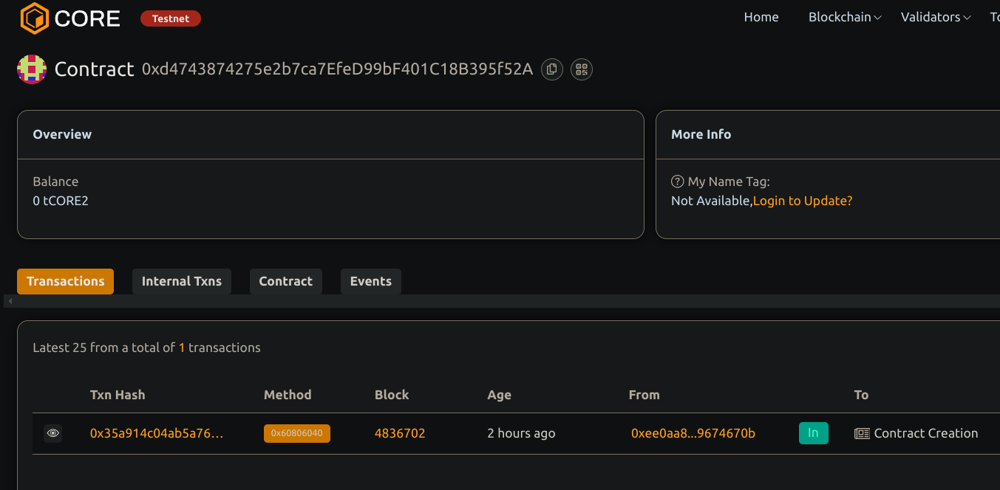

# DecentralizedComments

## Project Description
DecentralizedComments is a blockchain-based system enabling users to post comments or reviews on any item, identified by a unique hash or ID. Comments are stored on-chain to ensure transparency, censorship resistance, and immutability.

## Project Vision
To provide a trustless, tamper-proof commenting and review system that empowers users to share genuine feedback without centralized control or censorship.

## Key Features
- Add comments linked to any unique item ID
- On-chain storage of comments ensuring immutability and transparency
- Public retrieval of comments with commenter address and timestamp
- Event logs for every comment posted to enable easy tracking

## Future Scope
- Moderation and flagging mechanisms for inappropriate content
- Upvoting/downvoting or reaction system on comments
- User profiles and reputation scores linked to comments
- Integration with decentralized storage for larger media attachments

## Contract details
0xd4743874275e2b7ca7EfeD99bF401C18B395f52A
